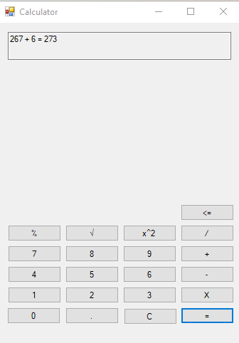
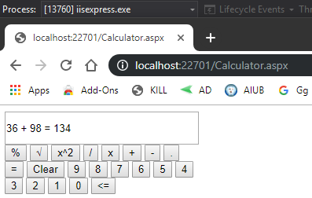

# Calculator-WebService-ASP.NET-CSharp
It's a simple basic Calculator which has two different UI. One is based upon WEB and Another is based upon Desktop and both using same back-end web-service to calculate the result. 
This is developed in this year 2019 based on Webservice using ASP.NET and C#

# Demo 

Desktop :   Web : 
